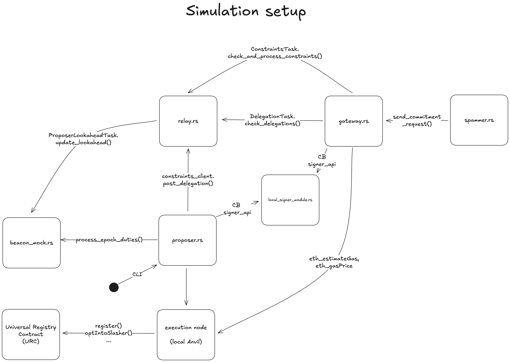

# Preconfirmation Gateway

A Rust-based preconfirmation gateway that enables Ethereum validators to issue commitments for transaction inclusion. The gateway implements the Commitments API specification and integrates with the Constraints API for relay communication, providing near-instant preconfirmation responses to users while ensuring compliance with Ethereum's block construction requirements.

## What This Does

The preconfirmation gateway system consists of three main components that work together to enable transaction preconfirmations:

- **Gateway**: Issues preconfirmation commitments to users via the Commitments API, coordinates constraint submission to relays, and manages delegation state from proposers
- **Proposer**: Manages validator registration with the URC (Universal Registry Contract), delegates commitment authority to gateways, and monitors upcoming proposer duties
- **Relay**: Coordinates between gateways and block builders via the Constraints API, maintains proposer lookahead information from the beacon chain, and routes constraints to builders

## Crate Structure

### Binary Crates (`bin/`)

- **`gateway.rs`** - Main gateway service combining the commitments RPC server with coordination tasks (delegation and constraint submission)
- **`proposer.rs`** - Proposer service that signs delegations based on the lookahead and exposes a CLI for URC operations.
- **`relay.rs`** - Relay service that monitors the lookahead and exposes a server for the Constraints API 
- **`spammer.rs`** - Load testing tool for simulating commitment requests to the gateway
- **`local-signer-module.rs`** - Local Commit-Boost signing module for development and testing
- **`beacon-mock.rs`** - Mock beacon node that exposes the lookahead for local testing

### Library Crates (`crates/`)

- **`common/`** - Shared infrastructure used across all services
  - Types and data structures
  - Database operations (RocksDB)
  - Configuration management
  - Slot timing and beacon chain client
  - Utilities and constants

- **`commitments/`** - Commitments API implementation
  - JSON-RPC handlers (`commitmentRequest`, `commitmentResult`, `slots`, `fee`)
  - Server state management
  - Request validation and processing

- **`constraints/`** - Constraints API client
  - Client to interface with relay
  - Constraint message creation and signing
  - BLS signature operations

- **`gateway/`** - Gateway coordination logic
  - Delegation task (monitors and updates delegation state)
  - Constraints task (submits constraints to relay)
  - Task coordinator

- **`proposer/`** - Proposer operations
  - URC registration and management
  - CLI for URC operations (register, opt-in, opt-out, collateral management)
  - Proposer lookahead processing

- **`relay/`** - Relay implementation
  - Relay server with constraints endpoints
  - Proposer lookahead task

## Architecture

The system components interact as follows when simulating:



## Local Development

### Prerequisites

- **Rust** (stable) - Install from [rustup.rs](https://rustup.rs/)
- **Just** - Task runner (`brew install just` on macOS)
- **Foundry** - For URC contract bindings (optional, only if modifying contracts)

### Building

```bash
# Build all binaries and libraries
cargo build --release
```

#### Building URC Bindings (Optional)

If you need to regenerate the Rust bindings for URC contracts:

```bash
# Install Foundry if not already installed
curl -L https://foundry.paradigm.xyz | bash
foundryup

# Initialize submodules
git submodule update --init --recursive

# Generate bindings
cd ./urc
forge bind --crate-name urc --overwrite --bindings-path ../crates/common/bindings/urc
```

### Running Locally

#### 1. Setup Simulation Environment

Generate the `.simulation.env` file with JWTs and configuration:

```bash
just setup-simulation
```

#### 2. Start Services

Run each service in a separate terminal:

```bash
# Terminal 1: Signer module
just run-local-signer

# Terminal 2: Mock beacon node
just run-local-beacon-mock

# Terminal 3: Relay
just run-local-relay

# Terminal 4: Proposer
just run-local-proposer

# Terminal 5: Gateway
just run-local-gateway

# Terminal 6: Spammer (optional - for load testing)
just run-local-spammer
```

## Docker Deployment

### Prerequisites

- Docker Desktop (for macOS/Windows) or Docker Engine (for Linux)
- `just` command runner (`brew install just`)

### Building Docker Images

Build all service images with a version tag:

```bash
# Build all images with 'dev' tag
just build-all dev

# Or build specific services individually
just build-gateway dev
just build-proposer dev
just build-relay dev
just build-spammer dev
just build-signer dev
just build-beacon-mock dev
```

Images are tagged as `preconfirmation-gateway/<service>:<version>`.

### Running with Docker Compose

#### Quick Start

Setup and run all services in one command:

```bash
just setup-and-run
```

This will:
1. Generate `.simulation.env` with JWTs
2. Start all services using Docker Compose

#### Manual Control

```bash
# Setup simulation environment
just setup-simulation

# Start all services
just up

# Start specific service
just up gateway

# View logs
just logs gateway
just logs proposer
just logs relay

# Stop all services
just down
```

#### Using Different Versions

```bash
# Use a specific version tag
just setup-and-run .simulation.env v1.0.0

# Or manually
export VERSION=v1.0.0
just up
```

## Configuration

### Config Files

The `config/` directory contains configuration files for each service:

- **`gateway.config.toml`** / **`gateway.docker.toml`** - Gateway service configuration (server settings, database paths, relay URL)
- **`proposer.config.toml`** / **`proposer.docker.toml`** - Proposer service configuration (signer, beacon API, URC settings)
- **`relay.config.toml`** / **`relay.docker.toml`** - Relay service configuration (port, beacon API, lookahead settings)
- **`spammer.config.toml`** / **`spammer.docker.toml`** - Load testing configuration
- **`signer.config.toml`** / **`signer.docker.toml`** - Signer module configuration (keystore paths)
- **`simulation.config.toml`** - Simulation environment settings (genesis timestamp, test keys)

**Note**: `*.config.toml` files are used for local development, while `*.docker.toml` files are used for Docker deployments.

## Proxy Key Generation

The gateway uses proxy BLS and ECDSA keys inside their Commit-Boost Signer Module for signing Constraints and Commitments respectively. Note the signer module must be running for the following commands:

### Generate Proxy Keys

```bash
# After running setup-simulation and starting the signer
just generate-proxy-key-gateway-ecdsa   # For commitment signing
just generate-proxy-key-gateway-bls     # For constraint signing
```

**Important**: After generating proxy keys, update the relevant configuration files (`gateway.config.toml` and `proposer.config.toml`) with the returned proxy key values.

## URC Operations

The proposer binary includes CLI commands for interacting with the Universal Registry Contract (URC):

```bash
# Register proposer BLS keys with URC
just proposer-register <URC_ADDRESS> <KEYSTORE_PATH> [PASSWORD]

# Opt-in to a slasher with a committer address
just proposer-opt-in <URC_ADDRESS> <REGISTRATION_ROOT> <SLASHER> <COMMITTER> <KEYSTORE_PATH> [PASSWORD]

# Opt-out of a slasher
just proposer-opt-out <URC_ADDRESS> <REGISTRATION_ROOT> <SLASHER> <KEYSTORE_PATH> [PASSWORD]

# Add collateral to registration
just proposer-add-collateral <URC_ADDRESS> <REGISTRATION_ROOT> <AMOUNT_WEI> <KEYSTORE_PATH> [PASSWORD]

# Unregister from URC
just proposer-unregister <URC_ADDRESS> <REGISTRATION_ROOT> <KEYSTORE_PATH> [PASSWORD]

# View all available commands
just help
```

See the [URC Registration Documentation](docs/URC_REGISTRATION.md) for detailed information on the registration process.

## Specifications

This project implements the following Ethereum preconfirmation specifications:

- [Commitments API](https://github.com/eth-fabric/commitments-specs/blob/main/specs/commitments-api.md) - User-facing API for requesting preconfirmations
- [Constraints API](https://github.com/eth-fabric/constraints-specs/blob/main/specs/constraints-api.md) - Builder/relay coordination API
- [Gateway Specification](https://github.com/eth-fabric/constraints-specs/blob/main/specs/gateway.md) - Gateway architecture and behavior

## License

See [LICENSE](LICENSE) file for details.
